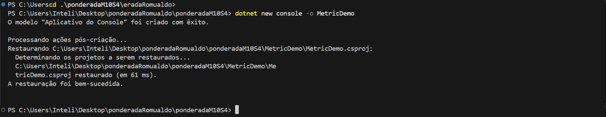
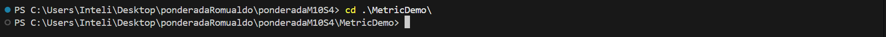
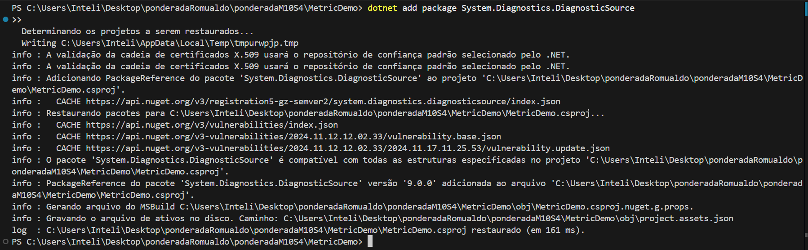
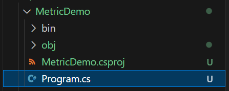
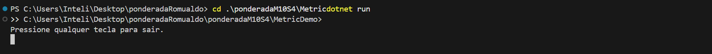
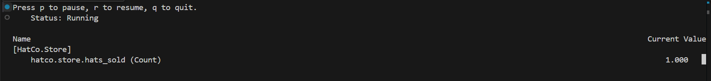

### README.md: Relatório do Tutorial "Criando Métricas"

# Criando Métricas com .NET

Este projeto implementa as atividades do tutorial "Criando Métricas". O objetivo é criar, registrar e monitorar métricas personalizadas em um aplicativo console utilizando .NET. Todas as etapas foram registradas neste arquivo, com capturas de tela ilustrando o progresso e os resultados obtidos.

---

## **Passo 1: Configuração do Projeto**

### 1. Criar o Repositório no GitHub
- Um repositório foi criado no GitHub para organizar e armazenar o projeto.
- **Link do Repositório**: [ponderadaM10S4](https://github.com/renanribeir0/ponderadaM10S4.git)

---

### 2. Inicializar o Projeto

1. No terminal, crie um novo projeto .NET Console e acesse o diretório:
   ```bash
   dotnet new console -o MetricDemo
   cd MetricDemo
   ```
   
   **Captura de tela - Criando o projeto (`dotnet new console`):**
   

   **Captura de tela - Acessando o diretório (`cd MetricDemo`):**
   

2. Adicione o pacote `System.Diagnostics.DiagnosticSource` para habilitar a instrumentação de métricas:
   ```bash
   dotnet add package System.Diagnostics.DiagnosticSource
   ```

   **Captura de tela - Adicionando o pacote (`dotnet add package`):**
   

---

### 3. Configurar o Código Base

1. Abra o arquivo `Program.cs` e insira o seguinte código para configurar uma métrica personalizada (`hatco.store.hats_sold`):
   ```csharp
   using System;
   using System.Diagnostics.Metrics;
   using System.Threading;

   class Program
   {
       static Meter s_meter = new Meter("HatCo.Store");
       static Counter<int> s_hatsSold = s_meter.CreateCounter<int>("hatco.store.hats_sold");

       static void Main(string[] args)
       {
           Console.WriteLine("Pressione qualquer tecla para sair.");
           while (!Console.KeyAvailable)
           {
               Thread.Sleep(1000);
               s_hatsSold.Add(4); // Simula a venda de 4 chapéus por segundo
           }
       }
   }
   ```

   **Captura de tela - Código no `Program.cs`:**
   
   

---

## **Passo 2: Execução e Registro de Métricas**

### 1. Executar o Aplicativo

1. No terminal, execute o programa:
   ```bash
   dotnet run
   ```

   **Saída esperada:**
   ```
   Pressione qualquer tecla para sair.
   ```

   **Captura de tela - Execução do programa (`dotnet run`):**
   

---

### 2. Monitorar Métricas em Tempo Real

1. Em outro terminal, use `dotnet-counters` para monitorar as métricas do contador `hatco.store.hats_sold`:
   ```bash
   dotnet-counters monitor -n MetricDemo --counters HatCo.Store
   ```

   **Saída esperada:**
   ```
   Press p to pause, r to resume, q to quit.
       Status: Running

   Name                                                 Current Value
   [HatCo.Store]
       hatco.store.hats_sold (Count)                          1.000    
   ```

   **Captura de tela - Monitoramento das métricas (`dotnet-counters`):**
   

---

## **Resultados**

### **Resumo**
- O projeto foi configurado para registrar métricas personalizadas simulando a venda de chapéus.
- A métrica `hatco.store.hats_sold` foi monitorada com sucesso, registrando o número total de chapéus vendidos.

### **Capturas de Tela**
- **Execução do programa:** 
- **Monitoramento das métricas:** 

---

## **Como Reproduzir Este Projeto**

1. Clone este repositório:
   ```bash
   git clone https://github.com/seu-repositorio.git
   cd MetricDemo
   ```

2. Execute o programa:
   ```bash
   dotnet run
   ```

3. Monitore as métricas:
   ```bash
   dotnet-counters monitor -n MetricDemo --counters HatCo.Store
   ```

---

## **Conclusão**

O tutorial "Criando Métricas" foi concluído com sucesso. O projeto demonstra como configurar métricas personalizadas em .NET e monitorá-las em tempo real, sendo uma ferramenta útil para análises de performance e dados operacionais.

---

## **Referências**

- [Microsoft Learn: Criando Métricas](https://learn.microsoft.com/pt-br/dotnet/core/diagnostics/metrics-instrumentation)
- [Dotnet Counters](https://learn.microsoft.com/pt-br/dotnet/core/diagnostics/dotnet-counters)
- [Documentação Oficial do .NET](https://learn.microsoft.com/pt-br/dotnet/)
